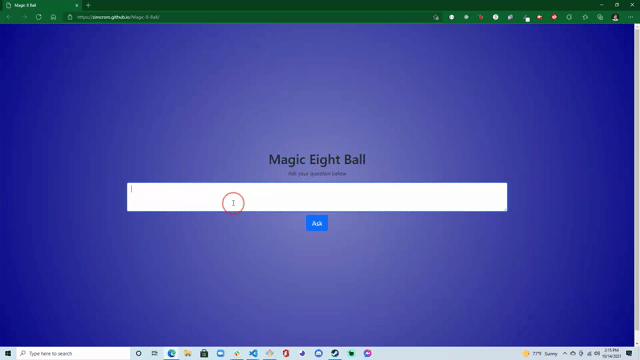

# Magic-8-Ball
*A learning example for bootcamp students learning beginner JS*

---

## Index
- [Elevator Pitch](#elevator-pitch)
- [Concept](#Concept)
- [Process](#Process)
- [Demo Gif](#demo-gif)
- [Future Development](#future-development)
- [Links](#Links)

## Elevator Pitch
When first learning JavaScript, it can be helpful to see an achieveable real life example. This is an easy site that can show students in different stages of JS learning ways they can implement the code that they know while helping them identify areas for improvement.

## Concept
I developed this site to help students see what a working JS app that they could make would look like, as well as to help them identify bad syntax/commits/etc. I've updated it to also showcase what a detailed README would look like as I feel that's also an important example to see. Beginner JS students can explore switch cases and lean on the alerts they're familiar with, while intermediate students can identify the poor mix of JQuery and vanilla JS, as well as the use of switch cases over an array. They can also notice me only working on the main branch, making some good commits and some poor and describe which is which, and my lazy use of an alert over hiding a results box and displaying it later.

User Story:
- **AS A** Teaching Assistant with students learning JavaScript
- **I WANT** to show an achieveable, but not well made application
- **SO THAT** they can learn, boost their confidence, and become better developers

## Process
- I based this off of a mini-project from Codecademy
- I was careful to make frequent commits, but to vary the quality (some just didn't make sense)
- When I show this application to beginner students, we discuss switch cases
- When I show this to more experienced students, we recode it together

## Demo Gif

## Future Development
- I'd like to make a secondary script file with a fully functional and well coded solution to this exercise for different levels of learning
- Could potentially create an 'unsolved' repo with a README of issues that they could work on, so that students could clone it down and code along

## Links
- [Repo Link](https://github.com/zimcrom/Magic-8-Ball/)
- [Site Link](https://zimcrom.github.io/Magic-8-Ball/)
